<div align="center">

# 🌊 OpenLake

### Open-Source Enterprise Data Lakehouse Platform

**A Dockerized, medallion-architecture lakehouse that ingests heterogeneous retail data and turns it into trusted, analytics-ready Gold tables — orchestrated by Airflow, transformed with PySpark and dbt, validated with Great Expectations, and observable end-to-end.**

[](.github/workflows/ci.yml)
[](pyproject.toml)
[](airflow/)
[](spark/)
[](dbt/)
[](data_quality/)
[-C72E49?logo=minio&logoColor=white)](docker/minio/)
[](pyproject.toml)
[](#-license)

[Overview](#-executive-overview) •
[Architecture](#-system-architecture) •
[Quick Start](#-quick-start) •
[Pipelines](#-etl-pipeline-flow) •
[Docs](#-documentation)

</div>

---

## 📖 Table of Contents

<details>
<summary>Click to expand</summary>

- [Executive Overview](#-executive-overview)
- [Business Problem & Motivation](#-business-problem--motivation)
- [Why OpenLake Exists](#-why-openlake-exists)
- [Key Features](#-key-features)
- [Technology Stack](#-technology-stack)
- [System Architecture](#-system-architecture)
  - [High-Level Architecture](#high-level-architecture)
  - [Medallion Architecture (Bronze → Silver → Gold)](#medallion-architecture-bronze--silver--gold)
  - [Component Interaction](#component-interaction)
  - [Deployment Architecture](#deployment-architecture)
- [End-to-End Data Flow](#-end-to-end-data-flow)
- [ETL Pipeline Flow](#-etl-pipeline-flow)
- [Airflow Orchestration](#-airflow-orchestration)
- [Data Lineage](#-data-lineage)
- [CI/CD Pipeline](#-cicd-pipeline)
- [Repository Structure](#-repository-structure)
- [Design Decisions & Engineering Principles](#-design-decisions--engineering-principles)
- [Data Modeling Approach](#-data-modeling-approach)
- [Metadata Management](#-metadata-management)
- [Data Quality Framework](#-data-quality-framework)
- [Logging & Monitoring](#-logging--monitoring)
- [Security Considerations](#-security-considerations)
- [Performance Optimizations](#-performance-optimizations)
- [Scalability Considerations](#-scalability-considerations)
- [Installation & Quick Start](#-quick-start)
  - [Prerequisites](#prerequisites)
  - [Docker Setup](#docker-setup)
  - [Local (non-Docker) Setup](#local-non-docker-setup)
  - [Configuration & Environment Variables](#configuration--environment-variables)
- [Running the Platform](#-running-the-platform-end-to-end)
- [Streamlit Console](#-streamlit-console)
- [Airflow UI Overview](#-airflow-ui-overview)
- [Example SQL Queries](#-example-sql-queries)
- [Example Outputs](#-example-outputs)
- [Testing Guide](#-testing-guide)
- [Troubleshooting](#-troubleshooting)
- [Future Roadmap](#-future-roadmap)
- [Contributing](#-contributing)
- [License](#-license)
- [Acknowledgements](#-acknowledgements)

</details>

---

## 🧭 Executive Overview

**OpenLake** simulates the internal data platform of a multinational retail company. It ingests data from four heterogeneous source systems — a REST API, two operational Postgres databases, and a weekly CSV file drop — and pushes it through a governed **Bronze → Silver → Gold** pipeline until it lands as a query-ready **star schema**, safe for BI dashboards and ad-hoc analytics.

Every architectural choice mirrors decisions a real data platform team makes: immutable raw storage for replayability, a distributed engine for row-level cleaning at scale, a declarative SQL layer for business logic, automated data quality gates, and first-class observability — not because the data volume in this repo demands it, but because the **patterns transfer directly** to a production environment handling terabytes.

> 📌 The full design rationale — including alternatives considered and rejected — lives in [`docs/architecture.md`](docs/architecture.md).

## 💼 Business Problem & Motivation

Retail organizations run on data scattered across incompatible systems:

| Pain Point | Real-World Consequence |
|---|---|
| Sales data lives in a transactional OLTP database, tuned for writes, not analytics | Dashboards run slow, ad-hoc queries lock production tables |
| Customer data arrives from a REST API with no historical replay | A bad transformation permanently loses history if not landed raw first |
| Supplier data is a weekly CSV drop with inconsistent formats | Manual cleanup, silent data quality regressions |
| No single source of truth for "is today's data actually fresh?" | Stakeholders lose trust in dashboards after a silent pipeline failure |
| Schema drift and broken joins discovered in production, not before | Bad numbers reach executives before an engineer notices |

**OpenLake solves this** by mimicking exactly how a mature data engineering team would: land everything raw and immutable, validate before it's trusted, transform with the right tool for each job, and make freshness/failure state a first-class, queryable thing — not something inferred by tailing logs.

## 🎯 Why OpenLake Exists

This platform was built to demonstrate **production-grade data engineering judgment**, not just tool familiarity:

- **Replayable by design** — Bronze is never mutated. A bug in Silver/Gold logic is fixed by reprocessing from Bronze, not re-ingesting from a source that may no longer hold the history (e.g. an API with no backfill window).
- **Right tool per layer** — PySpark for row-level engineering-heavy work (Bronze → Silver), dbt for declarative, testable business logic (Silver → Gold) — not one framework forced to do everything.
- **Cloud-portable from day one** — every dependency (MinIO, Postgres, Airflow) has a drop-in managed-cloud equivalent, so migrating to AWS/Azure/GCP is a **configuration change, not a rewrite**.
- **Observable, not just functional** — a custom metadata layer tracks lineage, freshness, and run history; a dedicated health-check DAG answers "is the platform healthy?" independent of whether today's pipeline run succeeded.
- **Tested like production code** — 80%+ enforced coverage, real `dbt test`/`dbt snapshot` runs in CI (not mocked), Airflow DAG structural validation, PySpark logic tested against real DataFrames.

## ✨ Key Features

| | |
|---|---|
| 🏗️ **Medallion Architecture** | Bronze (immutable raw) → Silver (cleaned/deduped) → Gold (star schema) |
| 🔌 **Heterogeneous Ingestion** | REST API, relational DB (generic, config-driven), CSV file drop — pluggable `BaseIngestion` interface |
| ⚙️ **Airflow Orchestration** | 4 production DAGs with cross-DAG sensors, cadence gating, TaskGroups, preflight checks |
| ⚡ **PySpark Transformations** | Distributed cleaning, casting, deduplication, referential-integrity enforcement |
| 🧱 **Dual Gold Implementation** | Hand-rolled DuckDB/Python *and* a real dbt project — same star schema, two engines |
| 📐 **SCD Type 2 Dimension** | `dim_customer` tracks full history via dbt snapshots *and* a Python equivalent |
| ✅ **Automated Data Quality** | Great Expectations suites per layer, per table — schema, null, referential-integrity checks |
| 🗂️ **Custom Metadata Layer** | Pipeline run history, table freshness, structural lineage — queryable, not log-mined |
| ❤️‍🩹 **Platform Health Checks** | Independent daily DAG answers "is anything stale or failing?" across every maintained table |
| 📊 **Streamlit Console** | Live operational dashboard over metadata, storage, and Airflow state |
| 🐳 **One-Command Local Stack** | Full 10-service Docker Compose stack — Postgres ×3, MinIO, Spark cluster, mock API, Airflow |
| 🧪 **CI-Enforced Quality** | Lint, type-check, 80%-floor test coverage, live `dbt run`/`dbt test`, Airflow DAG validation, Docker build — all on every PR |
| ☁️ **Cloud-Portable** | S3-compatible storage client, standard Postgres, vanilla Airflow — swap in managed services with zero code changes |

## 🛠️ Technology Stack

<table>
<tr><td valign="top">

**Core**

| Component | Technology |
|---|---|
| Language | Python 3.13 |
| Query language | SQL |
| Package/env management | [`uv`](https://docs.astral.sh/uv/) |
| Config validation | Pydantic v2 / pydantic-settings |

</td><td valign="top">

**Orchestration & Compute**

| Component | Technology |
|---|---|
| Orchestrator | Apache Airflow 2.10 (LocalExecutor) |
| Distributed compute | PySpark 3.5 |
| Business-logic transforms | dbt Core 1.8 (`dbt-duckdb`, `dbt-postgres`) |
| Embedded OLAP | DuckDB |

</td></tr>
<tr><td valign="top">

**Storage**

| Component | Technology |
|---|---|
| Object storage | MinIO (S3-compatible) |
| File format | Apache Parquet |
| Transactional sources | PostgreSQL 16 |
| Warehouse / metadata store | PostgreSQL 16 |

</td><td valign="top">

**Quality, Ops & Delivery**

| Component | Technology |
|---|---|
| Data quality | Great Expectations 1.x |
| Structured logging | Python `logging` (JSON formatter) |
| Testing | pytest, pytest-cov, moto (S3 mocking) |
| Lint / format | Ruff |
| Type checking | mypy |
| CI/CD | GitHub Actions |
| Containerization | Docker, Docker Compose |
| Operational UI | Streamlit |

</td></tr>
</table>

---

## 🏛️ System Architecture

### High-Level Architecture

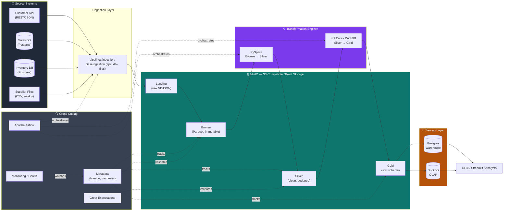

### Medallion Architecture (Bronze → Silver → Gold)

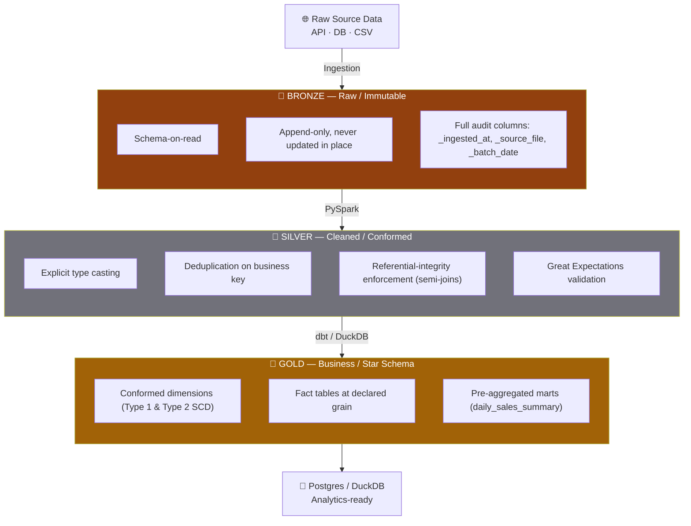

**Why medallion, not straight-to-warehouse?**

| Principle | Benefit |
|---|---|
| 🔁 **Replayability** | Bronze is immutable — any Silver/Gold bug is fixed by reprocessing from Bronze, no re-ingestion from a source system that may no longer hold the history |
| 🛡️ **Blast-radius isolation** | A broken transformation corrupts Silver/Gold only; the raw historical record is untouched |
| 👥 **Layered consumption** | Data scientists read Silver directly for exploration; BI dashboards read only the trusted Gold layer |

### Component Interaction

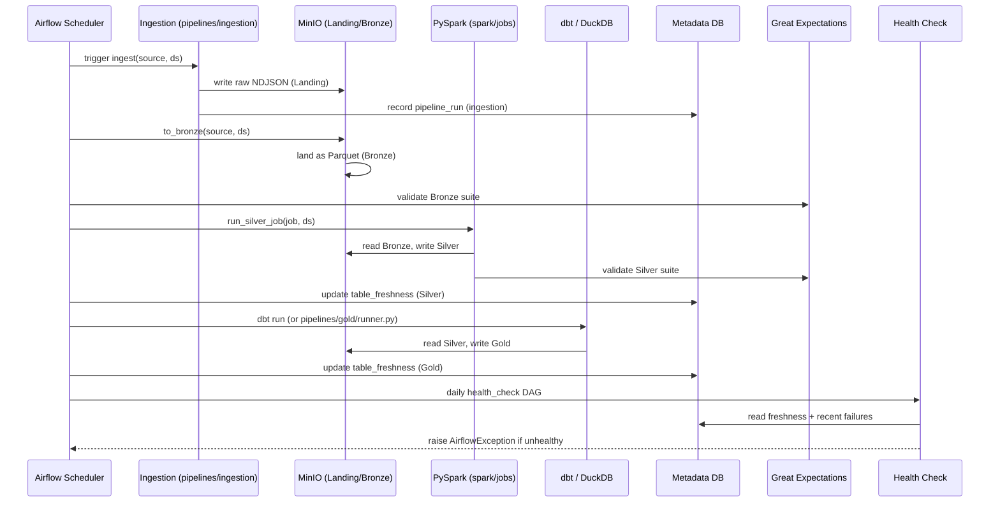

### Deployment Architecture

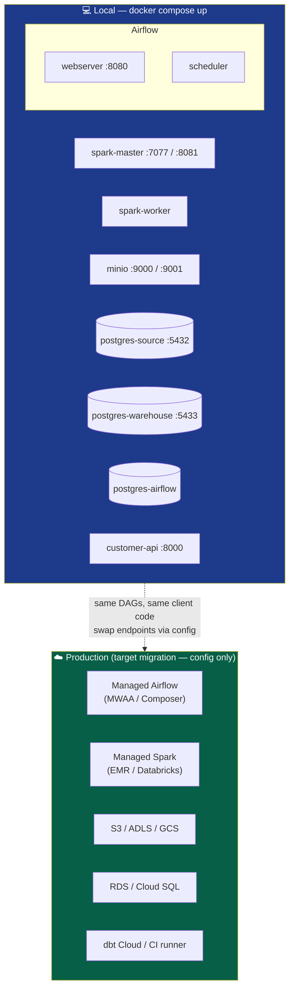

---

## 🔄 End-to-End Data Flow

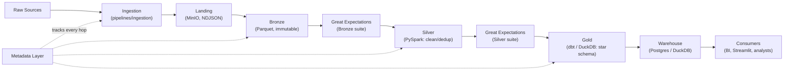

## 🔗 ETL Pipeline Flow

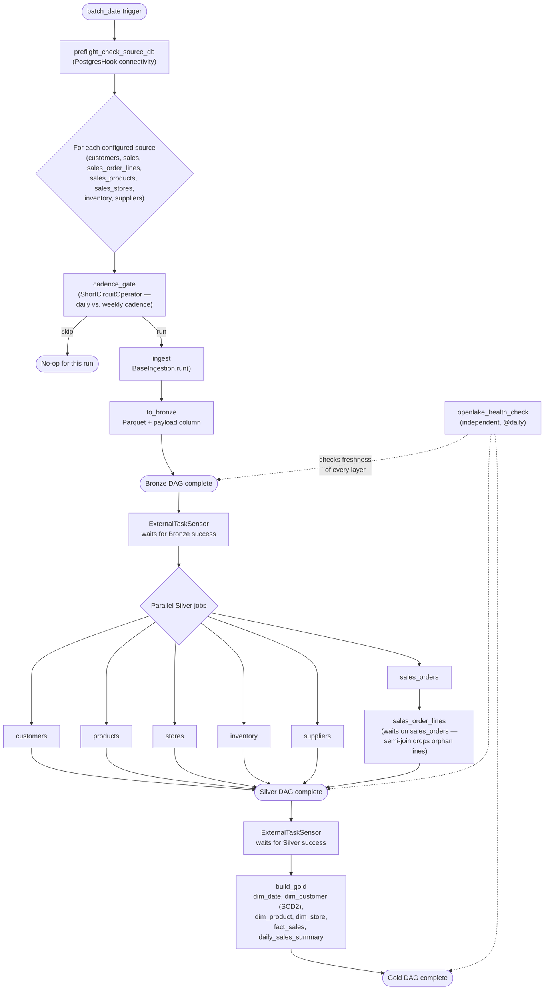

## 🌬️ Airflow Orchestration

Four production DAGs, each with a single responsibility — kept as separate DAGs (rather than one monolith) so each layer can be backfilled or rerun independently:

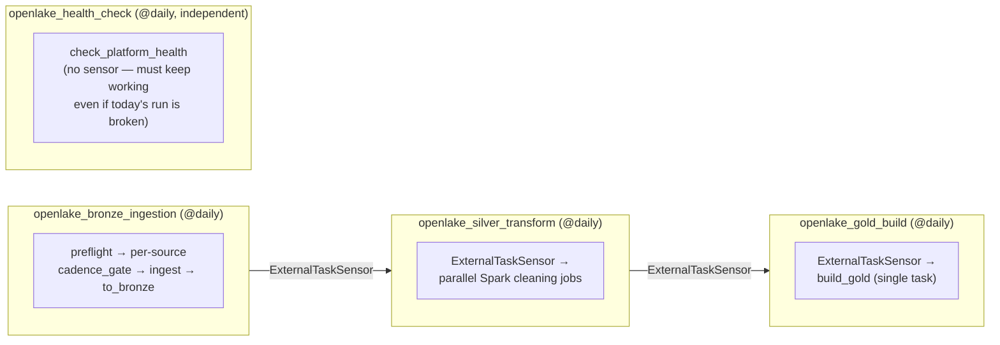

| DAG | Schedule | Purpose | Key Airflow Concepts |
|---|---|---|---|
| `openlake_bronze_ingestion` | `@daily` | Ingest all configured sources → land as Bronze Parquet | `TaskGroup` per source, `ShortCircuitOperator` for cadence gating, `PostgresHook` preflight |
| `openlake_silver_transform` | `@daily` | Clean/cast/dedup every Bronze table via PySpark | `ExternalTaskSensor`, parallel task fan-out, explicit dependency (`sales_order_lines` → `sales_orders`) |
| `openlake_gold_build` | `@daily` | Build the star schema from Silver | `ExternalTaskSensor`, single task by design (XCom isn't for bulk data) |
| `openlake_health_check` | `@daily`, independent | Is every maintained table fresh and failure-free? | Runs with **no** sensor — must detect a broken pipeline, not depend on it succeeding |

> Full task-by-task detail: [`docs/pipelines.md`](docs/pipelines.md).

## 🕸️ Data Lineage

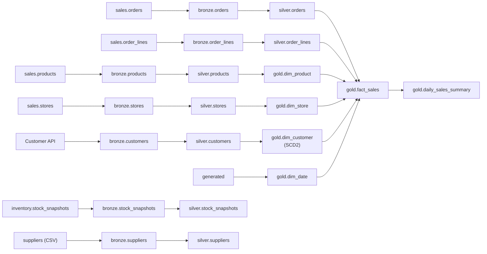

Lineage is not just a diagram — it's **queryable data**. `metadata.lineage` (seeded in `docker/postgres/init-warehouse/02_schema_metadata.sql`) stores the structural upstream/downstream edges; `metadata.pipeline_runs` correlates *which specific run* produced *which output* for a given `batch_date`, via `metadata.client.get_lineage(engine, layer, table_name)`.

## 🚀 CI/CD Pipeline

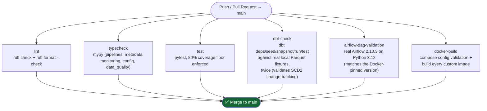

Six independent jobs run in parallel on every push/PR to `main` (see [`.github/workflows/ci.yml`](.github/workflows/ci.yml)):

| Job | What it actually validates |
|---|---|
| `lint` | Ruff linting + formatting, zero tolerance |
| `typecheck` | mypy across every first-party package |
| `test` | Full pytest suite; **build fails if coverage drops below 80%** (`--cov-fail-under=80`, no separate CI-only check) |
| `dbt-check` | A **real** `dbt run`/`dbt test`/`dbt snapshot` sequence against generated Parquet fixtures — run twice to prove SCD2 change-tracking actually works, not just that models compile |
| `airflow-dag-validation` | DAGs imported and validated against the **exact** Airflow version pinned in `docker/airflow/Dockerfile` (2.10.3, hence Python 3.12 — Airflow 2.x has no 3.13 build) |
| `docker-build` | `docker compose config` validity + every custom image actually builds |

---

## 📂 Repository Structure

```
openlake/
├── airflow/                # DAGs, plugins, Airflow-specific config
│   └── dags/                 bronze_ingestion, silver_transform, gold_build, health_check
├── pipelines/
│   ├── ingestion/             Per-source modules (api/, db/, files/) — pluggable BaseIngestion
│   ├── bronze/                Raw immutable landing logic (writer/reader)
│   ├── silver/                Silver job orchestration (runner, reader)
│   └── gold/                  Gold star schema — hand-rolled Python/DuckDB implementation
├── spark/
│   └── jobs/                 PySpark Bronze → Silver cleaning jobs, one per table
├── dbt/
│   ├── models/staging/        Silver source declarations
│   ├── models/marts/          Gold star schema (dbt implementation)
│   ├── snapshots/             SCD2 for dim_customer
│   └── seeds/                 Static reference data (region_metadata.csv)
├── data_quality/              Great Expectations suites + validation runner
├── metadata/                  Pipeline run / freshness / lineage tracking (SQLAlchemy)
├── monitoring/                 Structured logging config + platform health checks
├── config/
│   └── sources/               One YAML per source — schema-driven, no hardcoded values
├── console/                    Streamlit operational dashboard (components, services, styles)
├── docker/                    Dockerfiles + init scripts per service
├── scripts/                    Local-dev tooling (e.g. dbt fixture generator)
├── sample_data/                Synthetic seed data for local development
├── tests/                      pytest suite, mirrors pipelines/ 1:1
├── docs/                       Architecture, pipelines, data dictionary, deployment, dev guide
└── .github/workflows/          CI/CD (ci.yml)
```

Every top-level folder ships its **own `README.md`** with implementation-level detail — this file stays at the "what and why," module READMEs cover the "how."

### Module Descriptions

| Module | Responsibility |
|---|---|
| [`pipelines/ingestion/`](pipelines/ingestion/README.md) | Generic `BaseIngestion` ABC; concrete `api/`, `db/`, `files/` implementations land raw data to MinIO Landing |
| [`pipelines/bronze/`](pipelines/bronze/README.md) | Converts landed NDJSON into immutable, audited Parquet |
| [`pipelines/silver/`](pipelines/silver/README.md) | Orchestrates PySpark cleaning jobs; registry pattern (`_JOBS` dict) for job dispatch |
| [`pipelines/gold/`](pipelines/gold/README.md) | Star schema build via DuckDB SQL — dims, `fact_sales`, `daily_sales_summary` |
| [`spark/`](spark/README.md) | Per-table `clean(df)` + `run(batch_date)` PySpark jobs; testable core separated from I/O |
| [`dbt/`](dbt/README.md) | Second Gold implementation as real dbt models/snapshots/tests |
| [`data_quality/`](data_quality/README.md) | Great Expectations suite builders + a runner that validates any layer/table pair |
| [`metadata/`](metadata/README.md) | SQLAlchemy Core schema + client for `pipeline_runs`, `table_freshness`, `lineage` |
| [`monitoring/`](monitoring/README.md) | JSON structured logging config; `check_platform_health` freshness/failure logic |
| [`config/`](config/README.md) | Pydantic-settings env config + per-source YAML schema (`SourceConfig`) |
| [`console/`](console/) | Streamlit dashboard — KPI tiles, charts, pipeline/Airflow status views |
| [`docker/`](docker/README.md) | Per-service Dockerfiles and Postgres/MinIO init scripts |

---

## 🧠 Design Decisions & Engineering Principles

| Decision | Choice | Rationale |
|---|---|---|
| Storage format | Parquet everywhere | Columnar, compressed, splittable — native to Spark, DuckDB, and dbt alike |
| Object storage | MinIO (S3-compatible) | Code written against the S3 API works unchanged against real AWS S3 later — zero client rewrite on cloud migration |
| Bronze immutability | Append-only, never update/delete | Full audit trail + replay capability; a Silver/Gold bug never requires re-hitting a source system |
| Orchestrator | Apache Airflow | Industry-standard DAG scheduling, dependency management, and observability |
| Bronze → Silver engine | PySpark | Row-level cleaning/dedup/normalization is engineering-heavy and benefits from a general-purpose distributed engine |
| Silver → Gold engine | **Both**: hand-rolled DuckDB SQL (`pipelines/gold/`) *and* a real dbt project (`dbt/`) | The DuckDB path needed zero external services (embedded, no JVM/Docker) before a dbt setup existed; the dbt path formalizes the same tables as testable dbt models/sources/snapshots — dbt's `snapshot` mechanism replaces the hand-rolled SCD2 with the industry-standard tool for it |
| Warehouse | Postgres + DuckDB | Postgres for transactional-shaped queries and metadata; DuckDB for fast local OLAP on Gold Parquet — zero cloud cost, patterns transfer directly to Snowflake/BigQuery/Redshift |
| Metadata layer | Custom lightweight Postgres tables | Demonstrates lineage/freshness/ownership tracking without the operational overhead of a full catalog (Hive Metastore / Unity Catalog) — explicitly noted as a future upgrade path |
| Advanced table formats (Delta/Iceberg) | Deferred | ACID-on-object-storage adds real complexity, worth introducing only once the core medallion flow is solid |
| Config | YAML per source + `.env`, never hardcoded | A new source is a config change, not a code change (`DatabaseTableIngestion` is fully generic over any `(schema, table)`) |
| Comments | Only for non-obvious *why*, never *what* | Names should carry the "what"; a comment explaining a workaround, invariant, or real bug avoided earns its place |

**Cloud portability by construction** — every component swaps to a managed equivalent with a config change, not a rewrite:

| Local | Cloud equivalent |
|---|---|
| MinIO | S3 / Azure Blob / GCS (same S3-compatible client code) |
| Airflow (LocalExecutor) | MWAA / Cloud Composer / Azure Data Factory-managed Airflow (same DAGs) |
| Postgres | RDS / Cloud SQL / Azure Database for PostgreSQL |
| dbt | Unchanged — dbt already targets cloud warehouses natively |

## 🗃️ Data Modeling Approach

Gold is a **conformed star schema**, built identically by both Gold implementations:

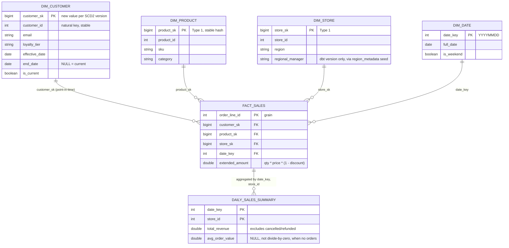

**Key modeling decisions:**

- **`dim_customer` is Type 2 SCD** — a change to email, name, or loyalty tier creates a new version with its own `customer_sk`; `fact_sales.customer_sk` joins to whichever version was effective **on `order_ts`**, not today's current value — a correct point-in-time join, not a lazy current-value join.
- **`dim_product` / `dim_store` are Type 1** — no business need for history, so surrogate keys are stable hashes of the natural key.
- **`fact_sales` grain is one row per order line** — the finest grain available, so it supports both line-level and any coarser rollup without re-aggregation loss.
- **`daily_sales_summary` explicitly excludes `cancelled`/`refunded` orders** from revenue — counting them would overstate actual sales performance, a deliberate business-logic decision, not an oversight.

Full column-level reference: [`docs/data_dictionary.md`](docs/data_dictionary.md).

## 🗂️ Metadata Management

A custom, lightweight metadata schema (`metadata/schema.py`, dialect-portable — runs against Postgres *and* SQLite for fast unit testing) tracks:

| Table | Purpose |
|---|---|
| `metadata.pipeline_runs` | Every run: pipeline, layer, source, table, batch_date, status, row_count, error_message |
| `metadata.table_freshness` | Per-table: last successful batch_date, last update timestamp, last row count |
| `metadata.lineage` | Structural upstream/downstream edges between tables — the static dependency graph |
| `metadata.schema_versions` | Schema evolution tracking per layer/table |

This is a deliberate **stand-in for a full data catalog** (Hive Metastore / Unity Catalog) — it demonstrates the same lineage/freshness/ownership concepts without the operational overhead, and is explicitly called out as a future upgrade path once scale demands it.

## ✅ Data Quality Framework

Built on **Great Expectations**, with one suite-builder function per table (`data_quality/suites.py`) and a generic runner (`data_quality/runner.py`) that validates any `(layer, table)` pair:

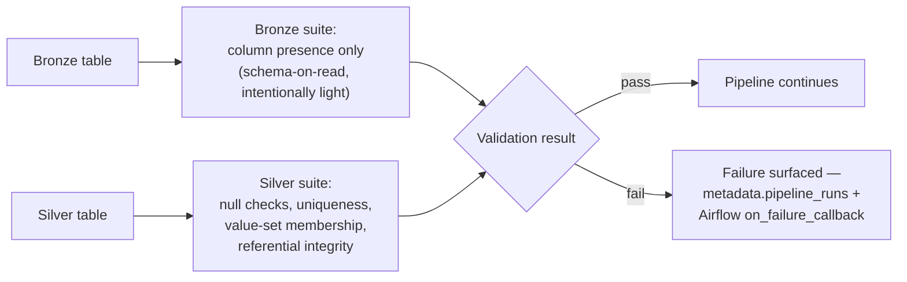

- **Bronze suites** are intentionally light — `ExpectTableColumnsToMatchSet` only. Bronze is schema-on-read by design; heavier checks would fight the layer's purpose.
- **Silver suites** enforce real invariants: `loyalty_tier ∈ {bronze, silver, gold, platinum}`, `order_status ∈ {pending, completed, cancelled, refunded, unknown}`, non-null natural keys, and referential integrity against valid-ID sets computed at validation time (not suite-definition time, since the valid set changes per run).

## 📈 Logging & Monitoring

- **Structured JSON logging** (`monitoring/logging_config.py`) — every log line is machine-parseable, ready to ship to CloudWatch/Datadog/ELK with zero reformatting.
- **`monitoring/health.py`** answers the question a platform team actually gets paged for: *"is any pipeline stale or failing right now?"* — built directly on the metadata layer (`get_freshness`, `list_recent_failed_runs`), not by tailing logs.
- **`openlake_health_check` DAG** runs independently every day with **no sensor dependency on the other DAGs** — the entire point is that health checking must keep working even if today's actual pipeline run is broken.
- **Staleness threshold**: a daily table not updated in >30 hours is flagged `stale`; failures in the last 24 hours are flagged `failing`.

## 🔒 Security Considerations

- **No secrets in source control** — `.env` is gitignored; `.env.example` documents every required variable with placeholder values only.
- **Config isolation** — all environment reads funnel through `config/settings.py`; no module reads `os.environ` directly, preventing scattered, unaudited credential access.
- **Least-privilege service boundaries** — MinIO, Postgres (source/warehouse/Airflow), and the mock Customer API each run as isolated containers with their own credentials, not a shared superuser.
- **S3-compatible client abstraction** (`pipelines/storage.py`) is the single I/O boundary for object storage — no module constructs its own `boto3` client, making credential rotation and access-pattern auditing a one-file change.
- **Airflow Connections** demonstrated via `AIRFLOW_CONN_OPENLAKE_SOURCE_DB` — the platform-native secrets mechanism, rather than DB credentials duplicated into DAG code.
- Production hardening notes (network policies, secrets managers, IAM-scoped S3 access) are tracked in [`docs/deployment_guide.md`](docs/deployment_guide.md).

## ⚡ Performance Optimizations

- **Columnar Parquet everywhere** — predicate/column pushdown at every read, across Spark, DuckDB, and dbt-duckdb alike.
- **Broadcast joins for referential integrity** — `sales_order_lines`' Silver job broadcast-joins against Silver `orders` to drop orphaned lines, avoiding a full shuffle join for what's fundamentally a small-side filter.
- **Explicit type casting in Silver** — Bronze hands every column through as strings; casting once at the Silver boundary means every downstream job reads a consistent, correctly-typed schema instead of re-inferring types repeatedly.
- **Gold as a single task, not per-table** — `build_gold` deliberately isn't split per dimension: splitting would mean passing full row-lists between Airflow tasks via XCom, which is designed for small metadata, not bulk data. Each Gold table is written to the bucket as it completes; if per-table parallelism is ever needed, each task re-*reads* its inputs from Gold rather than receiving them via XCom.
- **DuckDB for local OLAP** — zero-copy Parquet querying (`read_parquet('s3://...')` via `httpfs`), no warehouse round-trip needed for local validation or ad hoc analysis.

## 📐 Scalability Considerations

| Dimension | Current (local) | Scales via |
|---|---|---|
| Compute | 1 Spark master + 1 worker (2 cores, 2GB) | Add `spark-worker` replicas; same job code, no rewrite |
| Orchestration | Airflow `LocalExecutor` | Swap to `CeleryExecutor`/`KubernetesExecutor` — DAG code is executor-agnostic |
| Storage | MinIO single-node | Swap to real S3 — client code (`pipelines/storage.py`) is unchanged, only endpoint config |
| Warehouse | Single Postgres instance | Migrate to RDS/Cloud SQL with read replicas, or a cloud warehouse (Snowflake/BigQuery/Redshift) — dbt already targets these natively |
| Table format | Parquet, no ACID layer | Delta Lake / Apache Iceberg is an explicit, deferred future phase once core flow is proven |

---

## ⚡ Quick Start

### Prerequisites

- [Docker](https://docs.docker.com/get-docker/) & Docker Compose
- [`uv`](https://docs.astral.sh/uv/) (for local, non-Docker Python development)
- ~4GB free RAM for the full Docker Compose stack

### Docker Setup

```bash
# 1. Clone and configure
git clone https://github.com/<your-org>/openlake.git
cd openlake
cp .env.example .env

# 2. Bring up the full platform
docker compose up -d
```

This starts **10 services**: Postgres ×3 (source, warehouse, Airflow metadata), MinIO, a 2-node Spark cluster, the mock Customer API, and Airflow (webserver + scheduler, `LocalExecutor`). Buckets and source-system sample data are provisioned automatically on first boot.

| Service | URL | Credentials |
|---|---|---|
| Airflow UI | http://localhost:8080 | `admin` / `admin` (see `.env`) |
| MinIO Console | http://localhost:9001 | `openlake` / `changeme123` (see `.env`) |
| Customer API (mock) | http://localhost:8000 | — |
| Postgres (source) | `localhost:5432` | `openlake` / `changeme` |
| Postgres (warehouse) | `localhost:5433` | `openlake` / `changeme` |

Full service list, ports, and what each init script provisions: [`docker/README.md`](docker/README.md).

### Local (non-Docker) Setup

```bash
# Install uv, then:
make install        # uv sync --all-extras
make lint            # ruff check .
make typecheck       # mypy across first-party packages
make test            # pytest, 80% coverage floor enforced
```

**Per-layer extras** (PySpark tests need a JVM):

```bash
brew install openjdk@17          # macOS
export JAVA_HOME=$(brew --prefix openjdk@17)
pytest tests/silver/
```

Full setup detail, including adding a new source/table: [`docs/developer_guide.md`](docs/developer_guide.md).

### Configuration & Environment Variables

All configuration is env-driven via `.env` (never hardcoded, never read via bare `os.environ` outside `config/settings.py`):

| Variable | Purpose | Default |
|---|---|---|
| `OPENLAKE_ENV` | Environment name (`local`/`dev`/`prod`) | `local` |
| `SOURCE_DB_HOST/PORT/NAME/USER/PASSWORD` | Sales/Inventory operational Postgres | `localhost:5432` |
| `WAREHOUSE_DB_HOST/PORT/NAME/USER/PASSWORD` | Warehouse + metadata Postgres | `localhost:5433` |
| `MINIO_ENDPOINT/ACCESS_KEY/SECRET_KEY/SECURE` | S3-compatible object storage | `localhost:9000` |
| `MINIO_BUCKET_LANDING/BRONZE/SILVER/GOLD` | Per-layer bucket names | `openlake-{landing,bronze,silver,gold}` |
| `CUSTOMER_API_BASE_URL/KEY` | Mock REST source | `localhost:8000` |
| `AIRFLOW_UID`, `AIRFLOW_ADMIN_USER/PASSWORD` | Airflow container + admin user | `50000` / `admin` |
| `LOG_LEVEL` | Structured logging verbosity | `INFO` |

See [`.env.example`](.env.example) for the authoritative, fully-commented list.

## ▶️ Running the Platform End-to-End

1. `docker compose up -d` — seeds Sales/Inventory Postgres data and starts everything.
2. Open the Airflow UI (`localhost:8080`), unpause and trigger `openlake_bronze_ingestion` for a logical date.
3. `openlake_silver_transform` picks it up automatically via `ExternalTaskSensor`, then `openlake_gold_build` after that.
4. `openlake_health_check` runs independently, `@daily` — check its logs for a freshness/failure summary across every expected table.
5. Inspect results via the MinIO console (`localhost:9001`) for raw Parquet, or query Gold directly:

```python
import duckdb
con = duckdb.connect()
con.sql("SELECT * FROM read_parquet('s3://openlake-gold/gold/fact_sales/part-0.parquet')")
```
*(needs `httpfs` + MinIO S3 credentials configured in the DuckDB session — see `dbt/profiles.yml` for the exact settings.)*

## 📊 Streamlit Console

`console/` is a Streamlit operational dashboard over the platform's own metadata — KPI tiles, freshness/status views, and pipeline charts sourced from `metadata_service.py`, `storage_service.py`, and `airflow_service.py`.

```bash
uv run streamlit run console/app.py   # console/pages/ hosts the individual dashboard views
```

<div align="center">

*Dashboard screenshot placeholder — KPI row (rows ingested, active DAGs, tables healthy), freshness table, and revenue trend chart.*

``

</div>

## 🌬️ Airflow UI Overview

<div align="center">

*Screenshot placeholder — DAG graph view for `openlake_bronze_ingestion` showing the preflight check fanning out into per-source TaskGroups.*

``

*Screenshot placeholder — Airflow Grid view showing green runs across all four DAGs for a completed batch_date.*

``

</div>

## 🧾 Example Pipeline Execution

```bash
$ airflow dags trigger openlake_bronze_ingestion --exec-date 2024-06-01
$ airflow dags list-runs -d openlake_bronze_ingestion

dag_id                    | run_id                          | state   | logical_date
openlake_bronze_ingestion | scheduled__2024-06-01T00:00:00   | success | 2024-06-01T00:00:00+00:00
```

```
[2024-06-01 00:04:12] INFO  ingestion.customers  batch_date=2024-06-01 rows_landed=4213
[2024-06-01 00:04:15] INFO  bronze.writer         batch_date=2024-06-01 table=customers rows=4213 path=s3://openlake-bronze/bronze/customers/batch_date=2024-06-01/
[2024-06-01 00:07:41] INFO  silver.customers_silver batch_date=2024-06-01 rows_in=4213 rows_out=4198 rows_deduped=15
[2024-06-01 00:11:03] INFO  gold.runner            batch_date=2024-06-01 dim_customer_versions_created=37 fact_sales_rows=18422
[2024-06-01 00:11:04] INFO  metadata.client        table_freshness updated: gold.fact_sales last_successful_batch_date=2024-06-01
```

## 🔎 Example SQL Queries

<details>
<summary><strong>Top 10 stores by revenue, last 30 days</strong></summary>

```sql
SELECT s.store_name, s.region, SUM(f.extended_amount) AS revenue
FROM gold.fact_sales f
JOIN gold.dim_store s ON f.store_sk = s.store_sk
JOIN gold.dim_date d ON f.date_key = d.date_key
WHERE d.full_date >= CURRENT_DATE - INTERVAL '30 days'
  AND f.order_status NOT IN ('cancelled', 'refunded')
GROUP BY s.store_name, s.region
ORDER BY revenue DESC
LIMIT 10;
```
</details>

<details>
<summary><strong>Customer loyalty-tier revenue mix (point-in-time correct)</strong></summary>

```sql
SELECT c.loyalty_tier, COUNT(DISTINCT f.order_id) AS orders, SUM(f.extended_amount) AS revenue
FROM gold.fact_sales f
JOIN gold.dim_customer c ON f.customer_sk = c.customer_sk   -- version effective at order_ts
WHERE c.is_current OR f.date_key BETWEEN c.effective_date AND COALESCE(c.end_date, '99991231')
GROUP BY c.loyalty_tier
ORDER BY revenue DESC;
```
</details>

<details>
<summary><strong>Platform freshness check (metadata layer)</strong></summary>

```sql
SELECT layer, table_name, last_successful_batch_date,
       EXTRACT(EPOCH FROM (now() - last_updated_at)) / 3600 AS hours_stale
FROM metadata.table_freshness
WHERE last_updated_at < now() - INTERVAL '30 hours'
ORDER BY hours_stale DESC;
```
</details>

<details>
<summary><strong>Daily sales summary — DuckDB against Gold Parquet directly</strong></summary>

```sql
SELECT date_key, store_name, total_orders, total_revenue, avg_order_value
FROM read_parquet('s3://openlake-gold/gold/daily_sales_summary/*.parquet')
WHERE date_key >= 20240601
ORDER BY date_key, total_revenue DESC;
```
</details>

## 🧪 Example Outputs

```
$ dbt run --select marts
Running with dbt=1.8.x
Found 6 models, 4 sources, 2 seeds, 1 snapshot, 12 tests

1 of 6 OK created sql table model main.dim_date .......... [OK in 0.31s]
2 of 6 OK created sql table model main.dim_customer ....... [OK in 0.44s]
3 of 6 OK created sql table model main.dim_product ........ [OK in 0.28s]
4 of 6 OK created sql table model main.dim_store .......... [OK in 0.33s]
5 of 6 OK created sql table model main.fact_sales ......... [OK in 0.52s]
6 of 6 OK created sql table model main.daily_sales_summary  [OK in 0.19s]

Completed successfully
Done. PASS=6 WARN=0 ERROR=0 SKIP=0 TOTAL=6
```

## 🧪 Testing Guide

```bash
make test                          # full suite, coverage enforced at 80%
uv run pytest tests/silver/         # PySpark Silver jobs (needs JAVA_HOME)
uv run pytest tests/gold/           # DuckDB Gold build
uv run pytest tests/data_quality/   # Great Expectations suites
uv run pytest tests/airflow/        # DAG structural validation (skips if apache-airflow absent)
uv run pytest --cov-report=html     # generates htmlcov/ for a browsable coverage report
```

**Testing philosophy:**

- Silver jobs are tested against their pure `clean(df)` function with small in-memory DataFrames — not `run()`, which needs live S3/Bronze.
- dbt is tested with **real** `dbt run`/`dbt test`/`dbt snapshot` runs against generated local Parquet fixtures in CI — not mocked, and run twice to prove SCD2 change-tracking genuinely tracks changes.
- `metadata/client.py` is tested with real SQL execution against an in-memory SQLite engine (the schema is dialect-portable specifically to enable this) — not mocked queries.
- S3 interactions are tested against `moto`, a real (mocked) S3 API surface, not hand-rolled stubs.

## 🩺 Troubleshooting

<details>
<summary><strong>PySpark tests fail with "JAVA_HOME not set" or similar</strong></summary>

PySpark needs a real JVM. Install one and export `JAVA_HOME` before running Silver tests:
```bash
brew install openjdk@17
export JAVA_HOME=$(brew --prefix openjdk@17)
```
</details>

<details>
<summary><strong>Airflow won't install locally on Python 3.13</strong></summary>

Airflow 2.x has no Python 3.13 build. Either install a newer Airflow major version locally for validation only, or rely on the CI `airflow-dag-validation` job, which runs against the exact pinned version (2.10.3) on Python 3.12.
</details>

<details>
<summary><strong>`docker compose up` fails on port conflicts</strong></summary>

Ports 5432/5433/8000/8080/8081/9000/9001/7077 must be free. Check with `lsof -i :<port>` and stop the conflicting process, or remap ports in `docker-compose.yml`.
</details>

<details>
<summary><strong>Silver job produces zero rows</strong></summary>

Check `metadata.pipeline_runs` for the corresponding Bronze run's `row_count` first — an empty Silver output with a healthy Bronze row count usually means every row failed a cast or dedup key was null; check the Silver job's `clean()` logic against `docs/data_dictionary.md`'s documented null-drop rules.
</details>

<details>
<summary><strong>dbt snapshot doesn't detect a change I made</strong></summary>

`dim_customer_snapshot.sql` only tracks the columns declared in its `check_cols` — a change outside those columns won't trigger a new version by design. See `dbt/snapshots/dim_customer_snapshot.sql`.
</details>

## 🗺️ Future Roadmap

- [ ] Full data catalog (Hive Metastore / Unity Catalog) replacing the lightweight custom metadata schema
- [ ] Delta Lake / Apache Iceberg for ACID guarantees on object storage
- [ ] `dbt run` wired directly into `openlake_gold_build` as the primary Gold path (currently manual/parallel to the Python implementation)
- [ ] `KubernetesExecutor` for Airflow, enabling true per-task resource isolation and horizontal scaling
- [ ] Streamlit console pages for interactive lineage graph exploration
- [ ] Real cloud deployment reference (Terraform for AWS: MWAA + EMR + S3 + RDS)
- [ ] Data contracts / schema registry enforcing producer-side compatibility before ingestion
- [ ] Row-level and column-level access control at the Gold/warehouse layer

## 🤝 Contributing

Contributions are welcome. Before opening a PR:

1. Read [`docs/developer_guide.md`](docs/developer_guide.md) for local setup and code conventions.
2. Run `make lint && make typecheck && make test` — CI enforces all three plus dbt/Airflow-specific checks.
3. Follow the existing comment discipline: no comments explaining *what* code does — only *why*, when genuinely non-obvious.
4. New sources are config-driven (`config/sources/*.yaml`) — never hardcode source-specific values in Python.
5. Add tests alongside any new pipeline logic; the 80% coverage floor is enforced automatically, not manually checked.

## 📄 License

Distributed under the **MIT License**. See [`pyproject.toml`](pyproject.toml) for the license declaration.

## 🙏 Acknowledgements

Architected as a hands-on demonstration of production data-platform engineering, drawing design inspiration from the documentation and engineering practices of the Apache Airflow, Apache Spark, dbt Labs, Great Expectations, and MinIO open-source communities.

---

<div align="center">

**[⬆ Back to top](#-openlake)**

</div>
